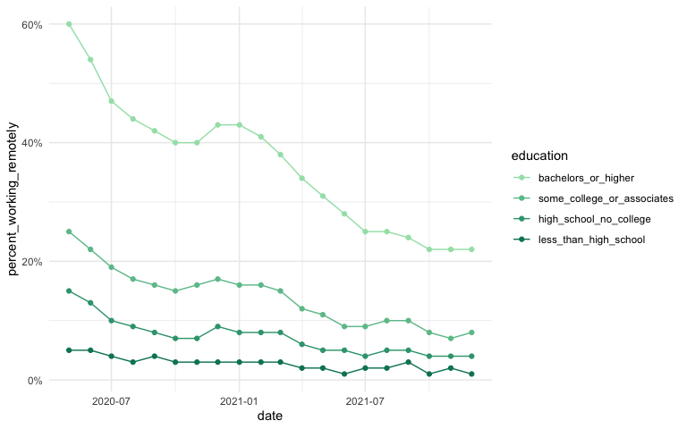

<!-- README.md is generated from README.Rmd. Please edit that file -->

# cori.charts

<!-- badges: start -->

[](https://github.com/ruralinnovation/cori.charts/actions/workflows/R-CMD-check.yaml)
<!-- badges: end -->

The goal of cori.charts is to make the process of creating
publication-ready graphics and charts at the Center for Rural Innovation
as easy as possible. Check out [the
guidelines](https://www.figma.com/file/gaAFFK9UHvs4baFXDlOKKR/CORI-Design-Guideline),
and then get started.

## Installation

You can install the development version of cori.charts from
[GitHub](https://github.com/) with:

``` r
# install.packages("devtools")
devtools::install_github("ruralinnovation/cori.charts")
```

## Example

This is a basic example which shows the application of the CORI theme:

``` r
library(ggplot2)
library(cori.charts)
data("cori_education")

ggplot(cori_education, 
       aes(date, percent_working_remotely, color = education)) +
  geom_line() +
  geom_point() +
  scale_color_cori(guide = guide_legend(reverse = TRUE)) +
  scale_y_continuous(labels = scales::percent) +
  theme_minimal()
```



Check out the vignette for a cookbook of CORI-themed plots!

## Contributing

Please note that the cori.charts project is released with a [Contributor
Code of
Conduct](https://contributor-covenant.org/version/2/1/CODE_OF_CONDUCT.html).
By contributing to this project, you agree to abide by its terms.
