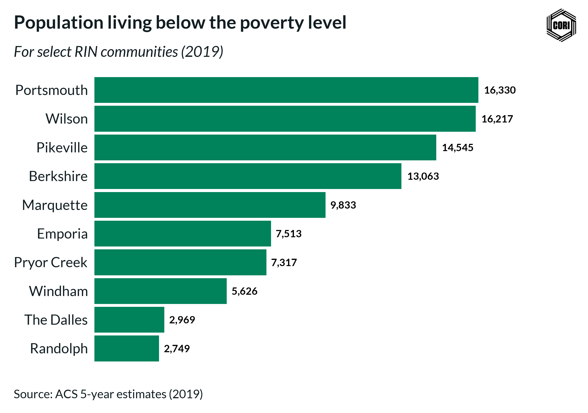
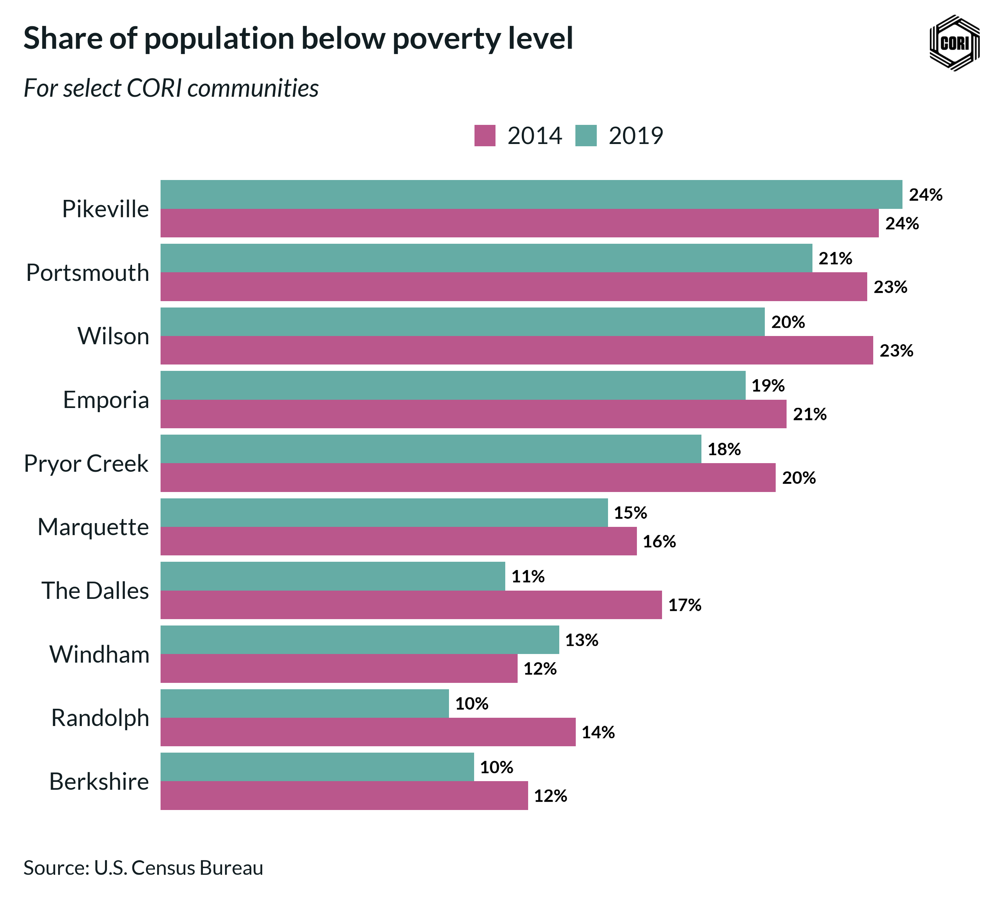
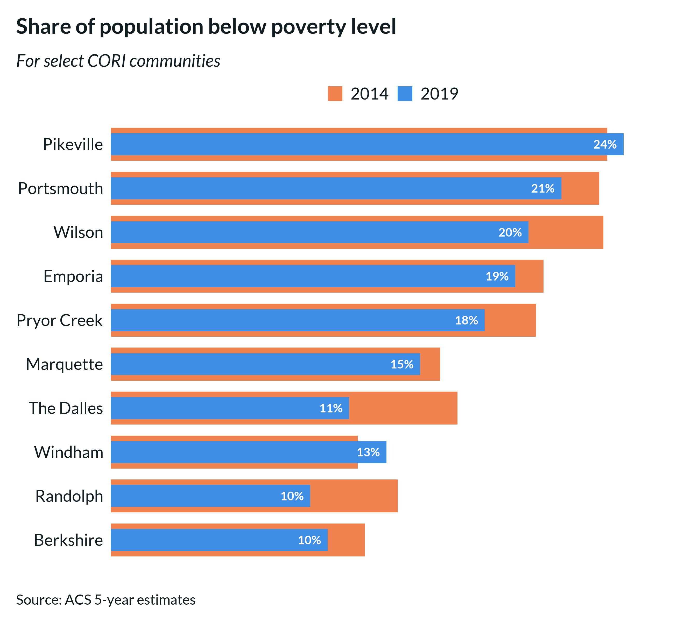
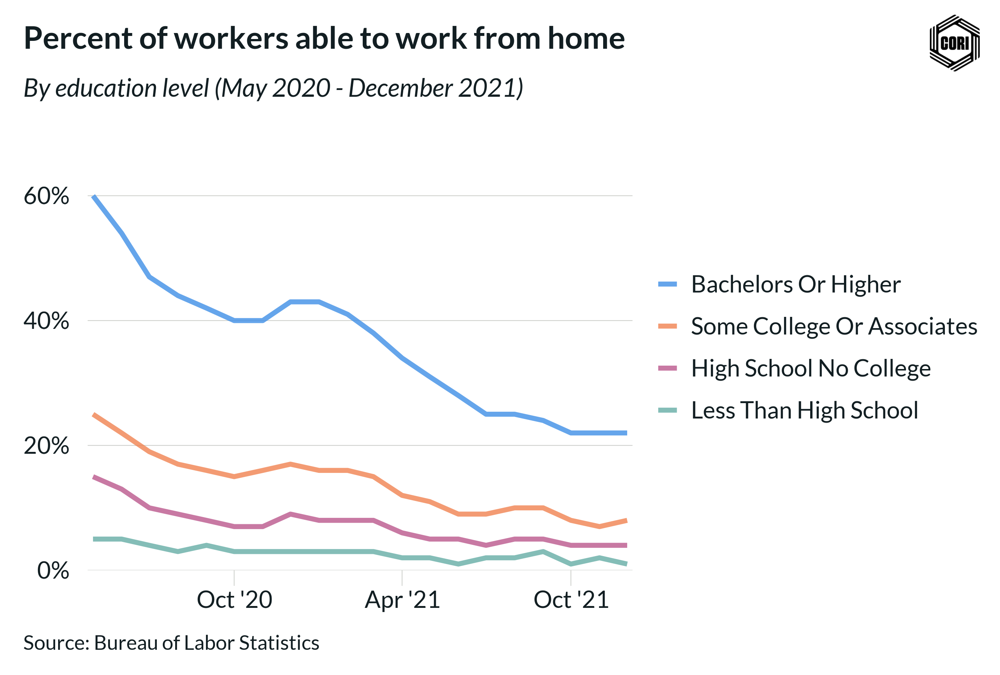
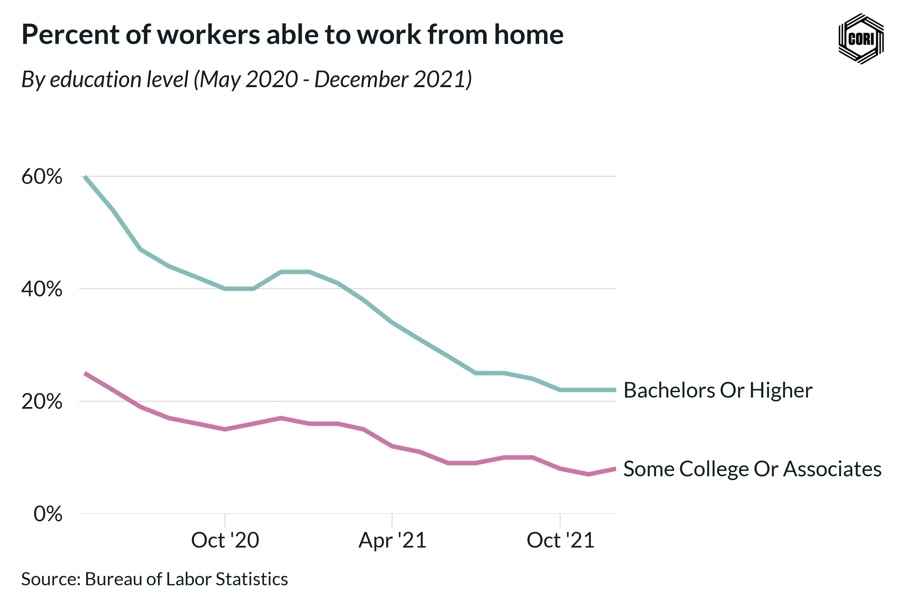
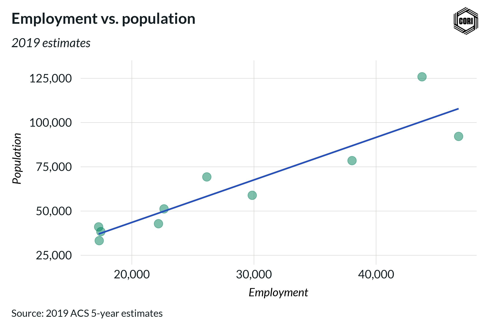

```{r, include = FALSE}
knitr::opts_chunk$set(
  collapse = TRUE,
  comment = "#>",
  # Chart settings
  fig.retina = 2,
  fig.width = 8,
  fig.asp = 1.2,
  fig.show = "hold",
  out.width = "100%"
)

# Set figure display options
options(dplyr.print_min = 6, dplyr.print_max = 6)

```

## Setup

### Load fonts into your environment

```{r, message=FALSE, warning = FALSE}
# For easily loading default Lato and Bitter fonts
# but you can specify other fonts too
cori.charts::load_fonts()

```

### Load required libraries

```{r, message = FALSE, warning = FALSE}
library(cori.charts)
library(ggplot2)
library(dplyr)
library(tidyr)
library(stringr)
library(here)

# I like to use the `here` package for working with file paths
i_am("vignettes/cookbook.Rmd")

```

### Load your data

We will be using a dataset which gives the population with an income below the 
poverty level in the last 12 months for a subset of RIN communities.
```{r}
data(cori_poverty)
dplyr::glimpse(cori_poverty)
```
Now we are ready to begin charting!

## Chart Recipes

----  

### Horizontal Bar Chart

```{r}
fig <- cori_poverty %>%
  ggplot2::ggplot(
    aes(
      estimate_below_poverty_level_2019,
      # Make RIN communities appear in descending order
      # based upon their population below the poverty level
      reorder(rin_community, estimate_below_poverty_level_2019)
    )
  ) +
  # Set the bar color the the CORI "Emerald" color
  ggplot2::geom_col(fill = cori_colors["Emerald"]) +
  # Add data labels to the bars
  geom_text(
    aes(
      # You can adjust the scales function depending on the desired
      # number format (e.g., percent, dollar, etc.)
      label = scales::number(
        estimate_below_poverty_level_2019,
        # accuracy determines what number to round to 
        # (e.g., accuracy = 0.01 will show 2 decimal places)
        accuracy = 1,
        # big.mark determines the character used between 
        # every 3 digits to separate thousands
        big.mark = ","
      )
    ),
    fontface = "bold",
    # Provide spacing between the data label and the bar position
    hjust = -.2,
    # Data labels need to have their font family explicitly set to "Lato"
    family = "Lato"
  ) +
  ggplot2::scale_x_continuous(
    # labels determines whether tick labels are shown
    labels = NULL,
    # You can provide an expansion multiplier to the axis to ensure that
    # data labels will have enough space
    expand = expansion(mult = c(0, .25))
  ) +
  # Call the horizontal bar theme to pull in default CORI theming
  theme_cori_horizontal_bars() +
  # Provide Title, subtitle, etc.
  ggplot2::labs(
    title = "Population living below the poverty level",
    subtitle = "For select RIN communities (2019)",
    y = NULL,
    x = NULL,
    caption = "Source: ACS 5-year estimates (2019)"
  )

# Always design a viz off a saved export
# Fixed dimensions are so important when designing!
cori.charts::save_plot(
  fig,
  here("vignettes/images/pop_below_pov_level.png")
)

```



----  

### Grouped Bar Chart

Pivot the data into a long format for easy plotting
```{r}
grouped_bar_data <- cori_poverty %>%
  mutate(
    percent_below_poverty_2014 = estimate_below_poverty_level_2014 / estimate_pop_2014,
    percent_below_poverty_2019 = estimate_below_poverty_level_2019 / estimate_pop_2019
  ) %>%
  pivot_longer(
    contains("percent"),
    names_to = "year",
    values_to = "percent_below_poverty"
  ) %>%
  mutate(
    year = str_remove(year, "percent_below_poverty_"),
    rin_community = reorder(rin_community, percent_below_poverty)
  ) 

glimpse(grouped_bar_data)
```

```{r}
fig <- grouped_bar_data %>%
  ggplot(aes(percent_below_poverty, rin_community, fill = year)) +
  geom_col(position = "dodge") +
  # Add in data labels
  geom_text(
    aes(label = scales::percent(percent_below_poverty, accuracy = 1)),
    # Need to add a position value to ensure that the data labels
    # are aligned with their appropriate bar
    position = position_dodge2(width = 0.9, reverse = FALSE),
    hjust = -.2,
    family = "Lato",
    fontface = "bold"
  ) +
  scale_fill_cori(palette = "ctg2tlpu", reverse = TRUE) +
  scale_x_continuous(
    # Axis labels are redundant to the data labels,
    # so we don't display them by setting labels = NULL
    labels = NULL,
    expand = expansion(mult = c(0, .1))
  ) +
  labs(
    title = "Share of population below poverty level",
    subtitle = "For select CORI communities",
    x = NULL,
    y = NULL,
    caption = "Source: U.S. Census Bureau"
  ) +
  theme_cori_horizontal_bars()

cori.charts::save_plot(
  fig,
  here("vignettes/images/grouped_bar_pop_below_pov_level.png"),
  # Adjust the height as needed, but avoid changing 
  # chart_width to prevent inconsistent scaling
  chart_height = 8
)

```



----  

### Bullet Chart

```{r, warning = FALSE, message = FALSE}
# Create a column for the width of the two bars using dplyr:: mutate()
#
# Generally, when comparing time periods, the wide bar is the
# earlier time period and the skinny bar is the later time period
bullet_chart_data <- grouped_bar_data %>%
  dplyr::mutate(
    width = ifelse(year == "2014", 0.75, 0.5)
  )

glimpse(bullet_chart_data)
```

```{r, warning = FALSE, message=FALSE}
fig <- bullet_chart_data %>%
  ggplot(aes(x = percent_below_poverty, y = rin_community, fill = year)) +
  # Determine the width using the "width" column we created above
  geom_col(width = bullet_chart_data$width) +
  # Add data labels for the later time period only
  geom_text(
    data = dplyr::filter(bullet_chart_data, year == "2019"),
    aes(
      x = percent_below_poverty,
      label = scales::percent(percent_below_poverty, accuracy = 1)
    ),
    hjust = 1.3,
    family = "Lato",
    color = "white",
    fontface = "bold"
  ) +
  scale_fill_cori(palette = "ctg2buor", reverse = TRUE) +
  scale_x_continuous(
    labels = scales::label_percent(accuracy = 1),
    expand = expansion(mult = c(0, .1))
  ) +
  labs(
    title = "Share of population below poverty level",
    subtitle = "For select CORI communities",
    x = NULL,
    y = NULL,
    caption = "Source: ACS 5-year estimates"
  ) +
  theme_cori_horizontal_bars()

cori.charts::save_plot(
  fig,
  here("vignettes/images/bullet_chart_pov_level.png"),
  chart_height = 8,
  # Logo can be turned off if needed
  add_logo = FALSE
)

```



----  

### Line Charts

```{r}
data("cori_education")

# Clean up the labels for the chart
line_chart_data <- cori_education %>%
  dplyr::mutate(
    # Remove underscores and convert to title case
    education_clean = stringr::str_to_title(stringr::str_replace_all(education, "_", " "))
  )

# Prep work so that the legend labels can be ordered based upon their final data point
#
# Filter to the final data point and pull the order
latest_date <- line_chart_data %>% pull(date) %>% max()
factor_order <- line_chart_data %>%
  dplyr::filter(date == latest_date) %>%
  dplyr::arrange(desc(percent_working_remotely)) %>%
  pull(education_clean)

# Update the column based upon the preferred order
line_chart_data <- line_chart_data %>%
  dplyr::mutate(education_clean = factor(education_clean, levels = factor_order))

glimpse(line_chart_data)
```
Simple line chart with right-hand legend
```{r, fig.asp=2/3}
# When using line charts, you need to 
# update the geom defaults before plotting
update_cori_geom_defaults()

fig <- line_chart_data %>%
  ggplot(
       aes(date, percent_working_remotely, color = education_clean)) +
  # A thicker line usually looks best
  geom_line(linewidth = 1.5) +
  scale_color_cori(palette = "ctg4mid", guide = guide_legend(reverse = TRUE)) +
  scale_x_date(
    date_breaks = "6 months",
    date_labels =  "%b '%y",
    expand = expansion(mult = c(.01,.01))
  ) +
  scale_y_continuous(
    labels = scales::label_percent(accuracy = 1),
    limits = c(0, .65),
    expand = expansion(mult = c(0, .1))
  ) +
  theme_cori() +
  ggplot2::theme(
    # CORI themes defaults to a horizontal legend below the title,
    # but with long names it can be easier to display the legend on the right
    legend.position = "right",
    legend.direction = "vertical",
    # Add spacing between keys
    legend.key.spacing.y = unit(12, "pt"),
    # Add ticks to the x-axis
    axis.ticks.x = element_line(color = "#d0d2ce", linewidth = .25),
    axis.ticks.length = unit(8, 'pt'),
    # Add margin to separate tick and text
    axis.text.x = element_text(margin = margin(t = 2)),
  ) +
  # In order for a legend on the right to render properly,
  # you need to specify that byrow = TRUE
  guides(color = guide_legend(byrow = TRUE)) +
  labs(
    title = "Percent of workers able to work from home",
    subtitle = "By education level (May 2020 - December 2021)",
    x = NULL,
    y = NULL,
    caption = "Source: Bureau of Labor Statistics"
  )

cori.charts::save_plot(
  fig,
  here("vignettes/images/line_chart_remote_worker_a.png"),
  chart_height = 6
)

```



Better yet, if your lines are spaced further apart, 
you can use a secondary axis to directly label the line endpoints
```{r, fig.asp=2/3}
# Let's filter to just two lines to simplify the chart
direct_label_data <- line_chart_data %>%
  dplyr::filter(
    education == "bachelors_or_higher" | education == "some_college_or_associates"
  )

# Determine the value and label at the most recent date for each line
line_labels <- direct_label_data %>%
  dplyr::filter(date == latest_date) %>%
  dplyr::arrange(desc(percent_working_remotely)) %>%
  pull(education_clean)

line_values <- direct_label_data %>%
  dplyr::filter(date == latest_date) %>%
  dplyr::arrange(desc(percent_working_remotely)) %>%
  pull(percent_working_remotely)

fig <- direct_label_data %>%
  ggplot(
    aes(date, percent_working_remotely, color = education_clean)
  ) +
  geom_line(linewidth = 1.5) +
  scale_color_cori(palette = "ctg2tlpu", guide = guide_legend(reverse = TRUE)) +
  scale_x_date(
    date_breaks = "6 months",
    date_labels =  "%b '%y",
    expand = expansion(mult = c(.01,0))
  ) +
  scale_y_continuous(
    labels = scales::label_percent(accuracy = 1),
    limits = c(0, .65),
    expand = expansion(mult = c(0, .1)),
    # Add the direct labels as a second axis
    sec.axis = sec_axis(
      transform = ~.*1,
      breaks = line_values,
      labels = line_labels
    )
  ) +
  theme_cori() +
  ggplot2::theme(
    # Remove the legend
    legend.position = "none",
    # Add ticks to the x-axis
    axis.ticks.x = element_line(color = "#d0d2ce", linewidth = .25),
    axis.ticks.length = unit(8, 'pt'),
    # Add margin to separate tick and text
    axis.text.x = element_text(margin = margin(t = 2)),
    # Adjust the space between the line and the line label
    axis.ticks.length.y.right = unit(2, "pt")
  ) +
  labs(
    title = "Percent of workers able to work from home",
    subtitle = "By education level (May 2020 - December 2021)",
    x = NULL,
    y = NULL,
    caption = "Source: Bureau of Labor Statistics"
  )

cori.charts::save_plot(
  fig,
  here("vignettes/images/line_chart_remote_worker_direct_labels.png"),
  chart_height = 6
)

```



----  

### Scatter Charts

```{r}

data("cori_employment")

fig <- cori_employment %>%
  ggplot(aes(x = estimate_employed_2019, y = estimate_pop_2019)) +
  geom_point(color = cori_colors["Emerald"], size = 5, alpha = 0.5) +
  geom_smooth(method = "lm", color = cori_colors["RISI Blue"], se = FALSE) + 
  scale_x_continuous(
    expand = expansion(mult = c(0.05, 0.05)),
    labels = scales::label_number(accuracy = 1, big.mark = ",")
  ) +
  scale_y_continuous(
    expand = expansion(mult = c(0.1, 0.1)),
    labels = scales::label_number(accuracy = 1, big.mark = ",")
  ) +
  labs(
    title = "Employment vs. population",
    subtitle = "2019 estimates",
    x = "Employment",
    y = "Population",
    caption = "Source: 2019 ACS 5-year estimates"
  ) +
  theme_cori() +
  theme(
    # Add back X panel
    panel.grid.major.x = element_line(color = "#d0d2ce", linewidth = .25),
    axis.ticks.x = element_line(color = "#d0d2ce", linewidth = .25),
    axis.ticks.length = unit(8, 'pt'),
    # Add margin to separate tick and text
    axis.text.x = element_text(margin = margin(t = 6))
  )

cori.charts::save_plot(
  fig,
  here("vignettes/images/scatter_employment_vs_pop.png"),
  chart_height = 6
)

```




----  

## Color selection

### Available colors

Commonly used colors from our [branding guidelines](https://company-50664.frontify.com/d/pz3pn2mB4FgP/center-for-rural-innovation-cori#/mapping-data-visualization/sequential-mapping-color-palettes) can be easily accessed using `cori.charts`. To specify a color, simply access the `cori_colors` list with the name of the color (e.g., `cori_colors["Emerald"]`)

### Color palettes

Several default color palettes are also provided. If you call `scale_color_cori` or `scale_fill_cori` without specifying the `palette` argument it defaults to Emerald and Bright Mint:

```{r, fig.asp = 1}
pal <- cori_palettes["ctg2gn"]
scales::show_col(unname(unlist(pal)))
```

This default palette is not always the best choice. The 
best color palette will depend on your data's format and content.

If you are comparing rural and nonrural, using our Rural vs Nonrural palette. 
Rural is Emerald and nonrural is Dark Purple.
```{r, fig.asp = 1}
pal <- cori_palettes["ctg2ruralnonrural"]
scales::show_col(unname(unlist(pal)))
```

If you are comparing two categories, I also recommend using 
the Mid Teal and Mid Purple palette
```{r, fig.asp = 1}
pal <- cori_palettes["ctg2tlpu"]
scales::show_col(unname(unlist(pal)))
```

or the Mid Blue and Mid Orange palette.
```{r, fig.asp = 1}
pal <- cori_palettes["ctg2buor"]
scales::show_col(unname(unlist(pal)))
```

If you want to show four categories, I recommend using the 4 category Mid Color palette.
```{r, fig.asp = 1}
pal <- cori_palettes["ctg4mid"]
scales::show_col(unname(unlist(pal)))
```

While there is a 7 category palette, I would think carefully before going beyond four categories in any graphic.
```{r, fig.asp = 1}
pal <- cori_palettes["ctg7"]
scales::show_col(unname(unlist(pal)))
```

